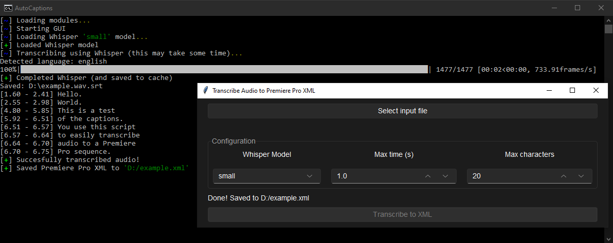
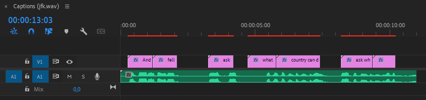

# AutoCaptions

**Transcribe an audio file to Premiere Pro layers**

A GUI tool that uses [OpenAI's Whisper](https://github.com/openai/whisper) to transcribe text from an audio/video file, into a Premiere Pro sequence to automate the creation of subtitles. Mainly for adding quick subtitles to action-packed video's, by making segments of a small word count. 

Outputs a `.xml` file which is a sequence containing text layers (Essential Graphics) that can be imported into your Premiere Pro project. 

## Installation

```cmd
git clone https://github.com/JorianWoltjer/AutoCaptions.git && cd AutoCaptions
python -m pip install -r requirements.txt
```

> **Warning**: The installation is not thoroughly tested, so let me know if any problems arise by creating an [Issue](https://github.com/JorianWoltjer/AutoCaptions/issues) for example. 

### Torch

Make sure to install the GPU enabled version of `torch` to make Whisper a lot faster:

```shell
python -m pip uninstall torch
python -m pip cache purge
python -m pip install torch -f https://download.pytorch.org/whl/torch_stable.html
```

### ffmpeg

An external dependency for Whisper that needs to be installed:

###### Windows

Install [Chocolatey](https://docs.chocolatey.org/en-us/choco/setup), then run the following command:

```cmd
choco install ffmpeg
```

###### Linux

```Shell
sudo apt update && sudo apt install ffmpeg
```

## Running

###### Windows

Simply create a shortcut to [`start.bat`](start.bat)

###### Linux

```shell
$ python3 main.py
```

## Example

Start the batch script, and select a file as input. Then some configuration is available and you can transcribe the audio:



The resulting XML file can then be imported into a Premiere project, where you can use and edit the text layers it created:



> **Tip**: To apply a style to all the text layers, you can create an Essential Graphics preset. Just do your settings on one of the layers, and then save it as a preset. Then you can drag the preset from your Project window to all the layers you select.
> 
> For animation keyframes you want to save an Animation Preset, which you can do by right-clicking on your created effect with keyframes and saving the Preset. Then you can drag it from your Effects window under Presets to all the layers you select. 

## Resources

* https://github.com/jianfch/stable-ts
* https://github.com/openai/whisper/discussions/3#discussioncomment-3730914
